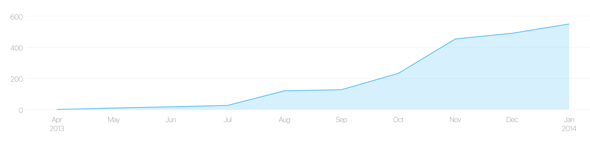
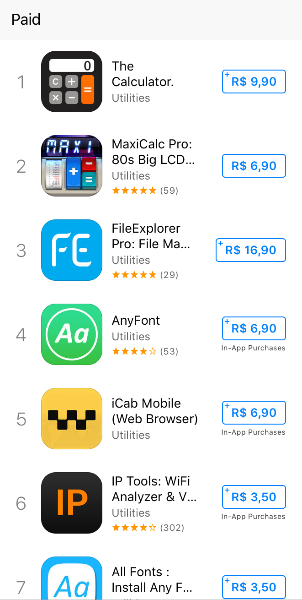
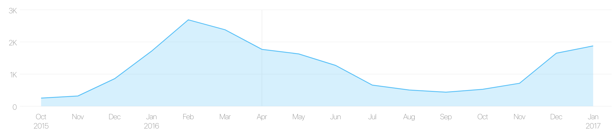

# É desenvolvedor mobile? Está esperando o que para ficar rico?

Desenvolvedores mobile possuem tudo o que precisam para para criar seus próprios apps e aumentar sua renda, no entanto poucos se aventuram nesse empreendimento. Vou compartilhar um pouco da minha experiência para ver se consigo mudar isso.

## Introdução

Olá. Trabalho como desenvolvedor de aplicativos mobile desde 2010. Apesar de já ter trabalhado com vários sistemas como Android, J2ME e Symbian, foi em iOS que me especializei. Ao longo desses anos (oito no momento em que escrevo) trabalhei em várias equipes, todas multidisciplinares, que incluiam  em geral programadores iOS, Android e Unity. Praticamente todos os desenvolvedores com os quais trabalhei eram apaixonados pelo que faziam: apps. Adoram iniciar novos projetos, desenvolver telas, experimentar arquiteturas novas, modelar, refatorar, lapidar, escovar, polir, e finalmente, lançar. E não acaba por aí. Também gostam de acompanhar os produtos, ler as opiniões dos usuários, analisar os dados de analytics, observar os possíveis crashes, pensar em funcionalidades novas, desejar a evolução dos produtos.

> Resumindo, desenvolvedores mobile são experts em criação de produtos.

Apesar disso, um fato infeliz que observei é que, dados os tantos desenvolvedores que já conheci, pouquíssimos acreditam ser possível desenvolver seus próprios apps. Reina o mito de que aplicativos só dão certo quando desenvolvidos dentro de empresas, por equipes grandes e com muito dinheiro investido.

Para os desenvolvedores que possuem tal visão, saibam que não só estão enganados, como estão desperdiçando ótimas oportunidades para ganhar dinheiro, experiência, conhecimento, reputação e motivação.

Vejamos se as minhas próprias experiências conseguem mudar essa idéia.

## MVP e metodologias ágeis

O que é um MVP quase todo mundo já sabe, _Minimum Viable Product_. Para quem não sabe está aqui um <a href='https://pt.wikipedia.org/wiki/Produto_vi%C3%A1vel_m%C3%ADnimo'>link</a> explicando. Agora, **compreender** o que é um MVP já é outra história. Muitas vezes, quando vejo as pessoas desenvolvendo algum produto, elas nunca o lançam por acharem que ainda não está bom o bastante. Isso é um erro!

Um dos meus primeiros apps (e o primeiro que deu bons resultados) foi um editor de partituras musicais. Trabalhei nele por um final de semana e o submeti para aprovação da Apple. Como resultado ele foi rejeitado, e o motivo alegado foi _"O seu app é simples demais"_. Isso quer dizer que o app era menos que um MVP. Com mais um dia de trabalho o app foi aprovado, e a partir daí fui lançando versões praticamente toda semana, durante cerca de um ano. As versões quase sempre eram pequenas, como melhorar uma imagem, mudar a formatação de um texto, adicionar micro-features e, quando dava, macro-features.

Como resultado observe o gráfico abaixo, de proceeds por mês. Durante este período considerado de dez meses trabalhei constantemente, lançando um total de 23 atualizações, evoluindo o app lentamente. Logo no segundo mês já comecei a monetizar e por volta do quinto mês comecei a ver uma escalada no número de vendas, o que me animou bastante. Se eu esperasse dez meses para publicar a primeira versão apenas para ter um app mais completo, provavelmente nunca o teria lançado. O MVP funciona, basta ter paciência e persistência que os resultados chegam.

É importante nunca deixar passar muito tempo entre o início do desenvolvimento e o lançamento, pois a motivação acaba diminuindo com o tempo. Eu mesmo já comecei várias features que nunca acabei, simplesmente porque demorei muito para terminar e acabei desanimando no meio do caminho.

## Não deu certo? Nada menos do que o esperado

Já publiquei 14 apps, dos quais 3 deles deram certo. _Certo_ quer dizer que tiveram um bom número de downloads, receberam bons reviews dos usuários e, principalmente, deram um bom dinheiro. O meu quarto app foi o primeiro que deu certo e o nono foi o que deu mais certo.

O primeiro foi um fracasso total. Ficou horroroso, o modelo de monetização era falho e não deu retorno algum. Acabei tirando da loja para não sentir vergonha de mim mesmo.

> Provavelmente o seu primeiro app será um fracasso.

Um dos motivos que faz a maioria dos desenvolvedores não acreditar ser possível publicar seus próprios apps é que dificilmente a primeira tentativa dá certo. Muitos já tentaram uma vez e falharam, acabaram concluindo que esse seria o único desfecho possível.

## As lojas e o modelo de publicação de apps

As principais lojas de apps (App Store e Google Play) foram idealizadas para favorecer tanto as empresas de grande porte quanto os pequenos desenvolvedores. Duvida? Vamos dar uma olhada no que encontramos na App Store, mais especificamente na categoria _Utilitários Pagos_.

Dos dez primeiros apps, temos os seguintes autores:

1. Impala Studios
2. Fernando Sciessere
3. Skyjos Co., Ltd.
4. Florian Schimanke
5. Alexander Clauss
6. Dmitry Dudarenko
7. Dropouts Technologies LLP
8. Krueger Systems, Inc.
9. feng jing
10. WinZip Computing LLC

Cinco são nomes de empresas e cinco são nomes de desenvolvedores independentes. Mesmo entre as empresas, a única conhecida é a WinZip, que por sinal está na décima posição. Todas as demais empresas poderiam muito bem pertencer a desenvolvedores independentes formalizados. Os desenvolvedores independentes conseguem sim encontrar seu espaço nas lojas e muitas vezes competir com empresas grandes.

Como resultado, o segundo app (MaxiCalc) obteve um faturamento aproximado no último ano de 41.400 dólares. Nada mal se esta renda for para um único desenvolvedor.

As lojas oferecem muitos atrativos. O custo da licença de desenvolvimento é baixo e acessível para qualquer um ($100 para iOS, $40 para Android). O processo de publicação é extremamente simples, deixando que as lojas se encarreguem de entregar o seu app para qualquer usuário no mundo que o queira. Existem disponíveis diversos meios de monetização in-app que, quando utilizados, poupam o desenvolvedor de terceirizar o meio de pagamento ou, pior, implementar o seu próprio.

Os pagamentos da Apple e Google para os desenvolvedores é feito por depósito direto na conta bancária, dispensando qualquer burocracia, sequer necessitando abertura de empresa. Uma empresa, brasileira inclusive, cuida de toda a movimentação financeira para você.

Para um primeiro momento (e provavelmente para qualquer momento), utilizar os recursos que as lojas oferecem é a melhor opção para facilitar o desenvolvimento de apps.

## Ganhou dinheiro? Não saia gastando tudo de uma vez

O mercado é imprevisível. Veja como exemplo o gráfico abaixo, novamente de proceeds por mês.

O espírito natalino traz uma maré de boa sorte que dura o primeiro semestre inteiro, porém vai embora no segundo semestre, até o próximo natal chegar e o ciclo se repetir.

Este tipo de comportamento não vale para todos os apps, cada um se comporta diferente, mas isso não importa. O ponto que quero chegar é o seguinte: e se um app novo for lançado em um momento pouco propício, por exemplo no mês de setembro deste gráfico? O resultado será fraco, mas não é porque o app não tem potencial, mas sim porque ainda não chegou o momento em que o mercado irá valorizá-lo. Quem abandonar o app antes deste momento chegar, provavelmente nunca colherá os frutos.

Isso não quer dizer que basta lançar um app e deixá-lo largado até que comece a dar resultados. Um app parado é um app morto, para se manter vivo é necessário fazer manutenção periódica, evolui-lo, colher dados e utilizá-los de forma construtiva, constantemente.

## Dinheiro não te motiva? Então que tal isto?

Publicar seus próprios apps traz outros benefícios além de aumento da renda, como experiência e conhecimento. Já trabalhei com desenvolvedores que mesmo no trabalho nunca publicaram algum app e por isso não conhecem as peculiaridades do processo. Quando conhecem, muitas vezes é apenas superficial.

Por exemplo, todo mundo sabe que para publicar nas lojas é necessário incluir screenshots do seu app, mas otimizar estas screenshots para aumentar os downloads já é um conhecimento que nem todos possuem. Geralmente o trabalho cotidiano de um dev não o leva a se preocupar com isso. 

Agora, quando você é o dono do produto e deseja vê-lo fazendo sucesso, acaba tendo uma motivação extra que o leva a aprender conceitos de produto que antes passavam desapercebidos. Este conhecimento, que vai além do esperado de um programador regular, traz um benefício excelente no ambiente de trabalho. Você deixar de se preocupar apenas com implementação e passa a se envolver nas decisões do produto, ajuda dando sugestões, cobre falhas no processo, identifica pontos de melhoria. Resumindo, cresce o produto e cresce a si mesmo.

## Conclusão

Em 2013 comprei um Mac mini justamente pensando em publicar meus próprios apps. Na época pensei _Será que algum dia vou conseguir retorno dos R$ 3.000 gastos nesse computador?_. Hoje, já tendo passado dos R$ 200.000 ganhos da Apple, posso me considerar um exemplo real de como criar apps é possível. Sou um desenvolvedor regular, não sou talentoso em design, não tenho as melhores idéias do mundo, não tenho nenhum grande capital para investir, trabalho eventualmente de noite e finais de semana, não viro madrugadas trabalhando, tenho dois filhos para cuidar, não abro mão da saúde e lazer. Existe algum dev que não se encaixa neste perfil?
